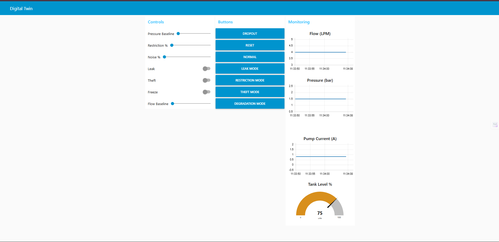

# Hydraulic Digital Twin Testbed (Node-RED)

A real-time hydraulic system digital twin and fault-injection platform built to support embedded IoT solutions for water infrastructure monitoring.

Designed for the **EmbedX 2.0 - An Embedded Systems & IoT Hackathon**, conducted by *PES University*, sponsored by *Xylem Water Solutions & Water Technology*, this simulator enabled participants to test microcontroller-based logic for energy efficiency, leak detection, and water theft detection using realistic sensor data streams.

---

## Overview

This Node-RED flow simulates a hydraulic pumping system and streams sensor data through multiple interfaces, allowing embedded devices to connect and validate anomaly detection logic in real time.

Instead of building separate setups for each challenge, this platform provides a **single configurable digital twin** capable of emulating multiple real-world fault conditions.

---

## Supported Hackathon Problem Statements

This testbed was designed to support all the official hackathon challenges:

### Energy Wastage Detection in Pump Operations
Simulates inefficient pump conditions by correlating:
- Flow rate
- Pressure
- Pump current

**Testable scenarios:**
- Flow obstruction
- Partial load conditions
- Gradual performance degradation
- High current with low flow

---

### Real-Time Water Usage & Leak Detection
Provides continuous monitoring of tank level and flow behavior.

**Testable scenarios:**
- Gradual tank depletion (leak simulation)
- Continuous flow during non-usage periods
- Sudden high-flow leak events
- Differentiating noise from actual leaks

---

### Water Theft & Unauthorized Usage Detection
Generates abnormal flow and pressure patterns indicative of unauthorized usage.

**Testable scenarios:**
- Sudden unexplained flow spikes
- Pressure anomalies
- Sensor data dropout (tampering simulation)
- Pattern-based anomaly detection

---

## Simulated Parameters

The digital twin generates realistic sensor data for:

- **Flow rate** (LPM)
- **Pressure** (bar)
- **Pump current** (A)
- **Tank level** (%)

Noise injection and configurable baselines allow realistic testing conditions.

---

## Fault Injection Modes

| Mode | Description | Use Case |
|------|------------|----------|
| Normal | Baseline operation | Control testing |
| Leak | Tank level gradually decreases | Leak detection |
| Theft | Flow increases unexpectedly | Unauthorized usage |
| Restriction | Reduced flow, increased pressure | Obstruction detection |
| Degradation | Gradual efficiency decline | Predictive maintenance |
| Freeze | Sensor stuck at last value | Sensor fault handling |
| Dropout | Random missing data | Communication failure |

---

## Data Outputs

The simulator streams sensor data through multiple communication channels to support different integration scenarios.

### TCP Server (Local Testing)
- Port: `5000`
- Purpose: Same-system communication for local clients and debugging tools.

### Serial Communication (Hardware Integration)
- 9600 baud → Microcontroller interface
- 115200 baud → High-speed device interface

Used by participants to connect Arduino, ESP32, or other embedded systems directly to the simulator.

### MQTT (Network IoT Integration)
- Topic: `hydraulic/data`
- Broker: configurable (default: local network)

Enables integration with:
- Edge gateways
- Cloud IoT platforms
- Remote monitoring dashboards

---

## Dashboard 



The dashboard provides real-time visualization and control of the hydraulic digital twin, enabling fault injection and monitoring of flow, pressure, pump current, and tank level.

### Controls
- Mode selection buttons
- Flow baseline adjustment
- Pressure baseline adjustment
- Restriction percentage
- Noise injection
- Leak / Theft / Freeze toggles

### Monitoring
- Flow chart (LPM)
- Pressure chart (bar)
- Pump current chart (A)
- Tank level gauge (%)

---

## Requirements

- Node-RED
- `node-red-dashboard`
- `node-red-node-serialport`
- MQTT broker 

---

## How to Run

**Install Node-RED**
```bash
npm install -g node-red
```

**Install required dependencies**
```bash
cd ~/.node-red
npm install node-red-dashboard node-red-node-serialport
```

**Import node flow**
- Open Node-RED
```bash
node-red
```
- Menu → Import → `flows.json`
- Deploy

**Open dashboard**
```bash
http://localhost:1880/ui
```

## Architecture

The simulator uses a physics-inspired model with configurable baselines and injected noise to emulate real hydraulic behavior.

**Data Flow**
- Simulation engine generates sensor values
- Fault modes modify behavior
- Data streamed via MQTT, TCP, and Serial
- Dashboard visualizes real-time metrics

## Authors
- [Nandita R Nadig](https://github.com/NanditaRN06)
- [Kritheesh](https://github.com/)

## License 

[MIT License](License)